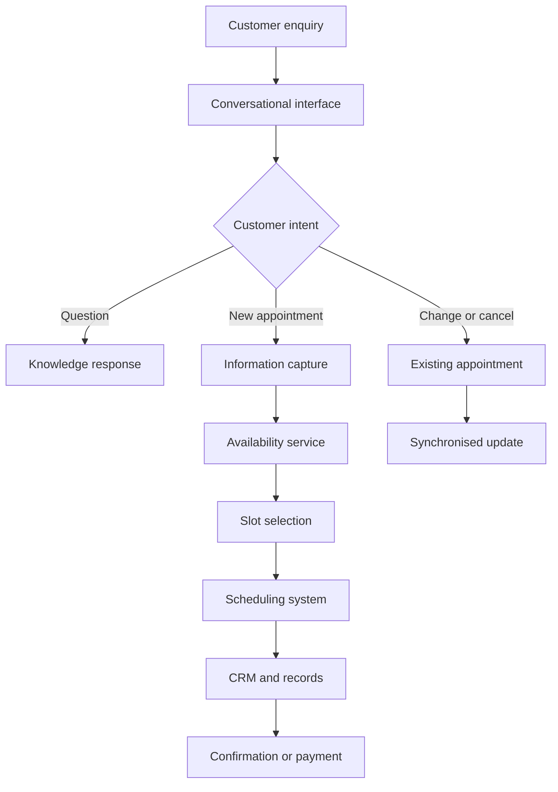

# End-to-End Appointment Automation

> A connected customer journey that turns enquiries into organised appointments.

## The operational problem

Appointment-based businesses often manage a single customer journey across disconnected systems:

- enquiries arrive through different channels;
- staff repeatedly collect the same information;
- availability is checked separately;
- booking details are manually transferred into operational records;
- updates and cancellations require further coordination;
- confirmations and payments can become disconnected from the appointment.

This creates slower responses, duplicated work, inconsistent records, and fragile handoffs.

## Solution architecture

## Core capabilities

### Conversational layer

- identifies the customer's intent;
- collects structured information;
- answers approved business questions;
- guides booking, update, and cancellation journeys;
- provides recovery or escalation when automation cannot proceed.

### Workflow orchestration

- coordinates actions across connected business systems;
- maps information between conversations, schedules, records, and payments;
- manages event-based responses and multi-step processes;
- keeps the customer journey moving across system boundaries.

### Scheduling integration

- checks available appointment capacity;
- creates appointments;
- updates or removes bookings when plans change;
- manages date, time, and timezone consistency.

### CRM and operational records

- stores customer and appointment information;
- maintains booking status and identifiers;
- keeps operational data available for follow-up and reporting;
- synchronises changes across the workflow.

### Customer communication

- supports familiar digital communication channels;
- delivers confirmations and next steps;
- allows customers to manage appointments without unnecessary staff intervention;
- preserves a route to a human when required.

## Reliability considerations

A useful implementation must handle more than one successful demonstration. It should account for:

- incorrect or incomplete customer information;
- timezone and date-format mismatches;
- availability changing during a conversation;
- duplicate submissions and repeated events;
- one connected system succeeding while another fails;
- delayed payment confirmation;
- customers returning through a new conversation;
- safe escalation when automation cannot complete the request.

## Data and privacy

A production deployment should collect only the information required for the workflow, restrict access to connected systems, protect credentials, and define data-retention and deletion rules. Regulated industries require a separate compliance review covering every vendor, data field, agreement, and operational process.

## Implementation process

1. Map the existing enquiry and appointment process.
2. Identify repetitive tasks, delays, and failure points.
3. Define the smallest automation that creates meaningful value.
4. Design the customer journey and system architecture.
5. Connect the required communication, scheduling, CRM, and payment systems.
6. Test normal paths, exceptions, and partial failures.
7. Pilot with controlled traffic.
8. Measure completion, staff intervention, and operational impact.
9. Refine before expanding the scope.

## Technology approach

The architecture is platform-independent. Tools are selected around the client's existing systems, security requirements, workflow complexity, budget, and ability to maintain the solution—not around loyalty to one software stack.

## Work with me

I work with appointment-based service businesses that want to reduce repetitive administration and create a more responsive customer journey. The first step is understanding the current operation and identifying where automation would produce real value.
