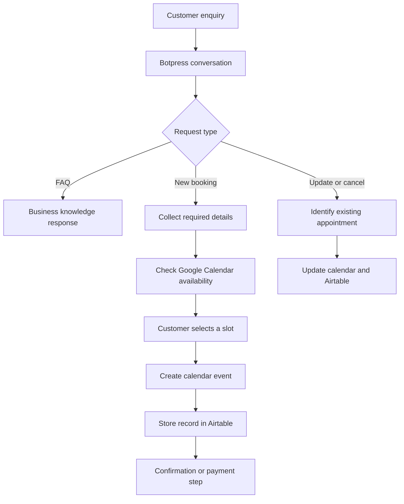

# Appointment Automation System

> A conversational workflow for turning service-business enquiries into organised appointments.

## Project status

This system is in active development and testing. It is presented as a technical case study, not as a claim of completed client results.

## The operational problem

Appointment-based businesses often manage one customer journey across several disconnected tools:

- customer questions arrive through chat;
- staff manually collect contact and booking information;
- availability is checked separately;
- details are copied into calendars or tables;
- changes and cancellations require more manual coordination;
- payment and confirmation steps can become disconnected from the booking.

The result can be slower responses, duplicated work, inconsistent records, and fragile handoffs.

## Proposed workflow

## System responsibilities

### Conversation layer — Botpress

- determines what the customer is trying to do;
- collects structured information;
- answers approved business questions;
- moves the customer through booking, update, or cancellation paths;
- presents clear recovery options when required data is missing.

### Integration layer — Make

- receives structured workflow data;
- coordinates actions across external services;
- maps fields between the conversation, database, calendar, and payment steps;
- handles webhook-based responses.

### Scheduling layer — Google Calendar

- provides availability inputs;
- creates appointment events;
- updates or removes events when the booking changes;
- requires RFC 3339-compatible timestamps and deliberate timezone handling.

### Data layer — Airtable

- stores customer and appointment information;
- provides an operational record outside the conversation;
- keeps booking status and identifiers available for later updates.

### Customer channel — WhatsApp or web chat

- gives customers a familiar place to ask questions and manage appointments;
- requires channel-specific testing because published-channel behaviour can differ from an emulator.

## Reliability considerations

The difficult part is not connecting one successful demo path. A usable implementation must also account for:

- incorrect or incomplete customer information;
- timezone and date-format mismatches;
- a slot becoming unavailable during the conversation;
- duplicate submissions and webhook retries;
- a calendar action succeeding while the database action fails;
- delayed payment confirmation;
- customers returning in a new conversation;
- safe escalation to a human when automation cannot complete the request.

## Data and privacy approach

A real deployment should collect only information required for the workflow, restrict access to connected systems, avoid exposing secrets in source control, and define retention and deletion rules. Healthcare deployments require a separate compliance review of every vendor, data field, agreement, and operational process; this prototype is not presented as automatically HIPAA compliant.

## Current development focus

- making conversations sound less robotic;
- strengthening state and error handling;
- synchronising calendar and Airtable records;
- validating webhook continuation behaviour;
- improving published WhatsApp workflow testing;
- separating payment confirmation from appointment creation where appropriate.

## Business implementation process

1. Map the business's existing enquiry and booking process.
2. Identify repetitive tasks and failure points.
3. Define the smallest valuable automation.
4. Build and connect the workflow.
5. Test normal paths, edge cases, and partial failures.
6. Pilot with controlled traffic.
7. Measure completion rate, staff time saved, and handoff frequency.
8. Refine before expanding scope.

## Built with

Botpress · Make · Airtable · Google Calendar · WhatsApp · Webhooks

## Work with me

I am open to pilot projects with appointment-based service businesses. The first conversation is about understanding the current workflow and deciding whether automation would create enough value to justify implementation.
